# Software Requirements Specification (SRS)
## FutureWalk — AI-Powered Gamified EdTech Platform

**Tagline:** Experience Tomorrow. Choose Today.

| Document Info | Details |
|---|---|
| Document Type | Software Requirements Specification |
| Version | 1.0 |
| Status | Draft for MVP Development |
| Prepared For | FutureWalk Engineering & Product Team |
| Intended Use | Direct input for AI coding tools (e.g., Cursor AI) and human engineering teams |

---

## Table of Contents

1. Executive Summary
2. Problem Statement
3. Vision
4. Objectives
5. Scope
6. Functional Requirements
7. Non-Functional Requirements
8. Complete Feature List
9. Detailed User Flow
10. Complete System Workflow
11. Use Case Diagram (Text Description)
12. User Stories
13. User Journey
14. Admin Journey
15. Database Design
16. Firestore Collections
17. ER Diagram (Text)
18. API List
19. Module-wise Architecture
20. AI Architecture
21. NLP Pipeline
22. ML Pipeline
23. Recommendation Engine Workflow
24. Future Simulation Workflow
25. Parent Mode Workflow
26. Admin Workflow
27. Folder Structure
28. UI Pages
29. Navigation Flow
30. Role-Based Authentication Flow
31. Security Requirements
32. Scalability Requirements
33. Deployment Architecture
34. Third-Party APIs
35. Risks & Assumptions
36. Future Enhancements
37. MVP Scope
38. Version 2 Features
39. Version 3 Vision
40. Development Roadmap
41. Sprint Planning
42. Testing Strategy
43. Pilot Testing Plan
44. KPIs & Success Metrics
45. Startup Scaling Strategy
46. Appendix

---

## 1. Executive Summary

FutureWalk is an AI-powered, gamified EdTech platform built for Gen Z and Gen Alpha students who face uncertainty when choosing a career path. Rather than relying on static aptitude tests, FutureWalk uses Artificial Intelligence, Machine Learning, Natural Language Processing, Large Language Models, and 3D immersive simulation to let students *experience* careers before committing to them.

The platform combines a personalized AI Mentor, an immersive "Future Simulation" engine, job-role simulations at real-world-style companies, a dedicated "Parent Convince Mode," a personalized roadmap generator, a scholarship and opportunity hub, and a full gamification layer (XP, streaks, badges, leaderboards). The system is designed to launch as a lean MVP on a modern JAMstack + Firebase architecture, and to scale into a global multi-institution EdTech product with corporate and government partnerships in later phases.

This SRS defines the functional and non-functional requirements, data model, API surface, AI/ML architecture, UX flows, and delivery roadmap required to take FutureWalk from MVP to a scalable, production-grade startup platform.

## 2. Problem Statement

Students across school, intermediate, and undergraduate levels routinely make career decisions with:

- Little to no real exposure to what a career actually looks like day-to-day
- Aptitude tests that produce generic, low-context recommendations
- Parental pressure toward "safe" traditional careers, often because parents cannot visualize alternative paths
- Fragmented, ad-hoc information about scholarships, internships, and skill-building opportunities
- No continuous, personalized guidance system that adapts as the student's skills and interests evolve

The result is a systemic mismatch between student potential and career choice, leading to disengagement, dropout, and career dissatisfaction later in life.

## 3. Vision

To become the world's leading AI-powered career discovery platform, where every student — regardless of geography or economic background — can *virtually live* their future before choosing it, and every parent can understand and support that choice with data-backed confidence.

## 4. Objectives

| Objective | Description |
|---|---|
| O1 | Deliver a personalized AI Mentor experience for every student user |
| O2 | Build a Future Simulation engine that generates career-specific immersive experiences from student profile data |
| O3 | Provide parents with an evidence-based dashboard to support career decisions |
| O4 | Generate actionable, semester-wise career roadmaps |
| O5 | Aggregate scholarships, hackathons, and internships relevant to each student |
| O6 | Drive engagement and retention through gamification |
| O7 | Build an architecture that scales from MVP to millions of users across institutions and geographies |
| O8 | Establish a defensible AI/data moat via continuous skill assessment and recommendation refinement |

## 5. Scope

### In Scope (Platform-wide)
- Student-facing web application (Next.js/React) with AI Mentor, Future Simulation, Job Simulation, Roadmap, Gamification, Skill Assessment, and Dashboard
- Parent-facing dashboard ("Parent Convince Mode")
- Admin dashboard for platform management
- AI/ML services for recommendations, NLP-driven conversation, and simulation content generation
- Firebase-based backend (Auth, Firestore, Storage, Hosting) with a Node.js/Express API layer
- Gamification and notification systems

### Out of Scope (for this SRS / MVP)
- Native mobile applications (planned post-MVP)
- Full corporate/recruiter marketplace (Future Expansion phase)
- Government integration APIs (Future Expansion phase)
- Payment/monetization engine details beyond high-level mention (to be specified in a separate Commercial SRS)
- Code implementation (this document is requirements-only, per project instruction)

## 6. Functional Requirements

| ID | Requirement | Priority |
|---|---|---|
| FR-1 | System shall allow students to register/login via Firebase Auth (email, Google, phone OTP) | Must |
| FR-2 | System shall allow students to create and edit a profile (interests, skills, marks, hobbies, personality, career goals) | Must |
| FR-3 | System shall provide each student a personalized AI Mentor with customizable avatar and personality | Must |
| FR-4 | AI Mentor shall answer career questions, academic doubts, and provide motivational responses | Must |
| FR-5 | AI Mentor shall recommend learning resources, certifications, and internships | Must |
| FR-6 | System shall generate a Future Simulation based on student profile data | Must |
| FR-7 | Future Simulation shall support at least 10 career paths at MVP launch (AI Engineer, Doctor, Lawyer, Pilot, Entrepreneur, Scientist, Game Developer, IAS Officer, Data Scientist, UI/UX Designer) | Must |
| FR-8 | System shall allow students to converse with an AI-generated "Future Self" | Must |
| FR-9 | System shall provide Job Simulation modules (interviews, meetings, coding tasks, teamwork, presentations, client interactions) mapped to sample organizations | Should |
| FR-10 | System shall provide a Parent Dashboard with skill analysis, future demand, salary projection, growth graph, and roadmap summary | Must |
| FR-11 | System shall generate a semester-wise personalized career roadmap | Must |
| FR-12 | System shall recommend scholarships, hackathons, internships, competitions, and courses based on student profile | Must |
| FR-13 | System shall implement gamification: XP, levels, streaks, badges, achievements, leaderboards, missions | Must |
| FR-14 | System shall assess technical and soft skills continuously and update recommendations accordingly | Must |
| FR-15 | System shall provide a Student Dashboard summarizing progress, XP, chats, roadmap, opportunities, and skill graphs | Must |
| FR-16 | System shall provide an Admin Dashboard to manage users, careers, scholarships, jobs, mentors, analytics, content, and feedback | Must |
| FR-17 | System shall support role-based access control (Student, Parent, Admin) | Must |
| FR-18 | System shall log and expose analytics/reporting to Admins | Should |
| FR-19 | System shall send notifications (streak reminders, new opportunities, mentor nudges) | Should |
| FR-20 | System shall support feedback submission from students and parents | Could |

## 7. Non-Functional Requirements

| ID | Category | Requirement |
|---|---|---|
| NFR-1 | Performance | Core pages (Dashboard, Mentor Chat) shall load within 2.5s on 4G connections |
| NFR-2 | Scalability | Backend shall support horizontal scaling to accommodate 1M+ registered users |
| NFR-3 | Availability | Platform shall target 99.5% uptime post-MVP |
| NFR-4 | Security | All PII shall be encrypted at rest and in transit (TLS 1.2+) |
| NFR-5 | Privacy | Platform shall comply with applicable data protection norms (e.g., India DPDP Act, GDPR for international users) given students, many of whom are minors, are core users |
| NFR-6 | Usability | UI shall follow WCAG 2.1 AA accessibility guidelines where feasible |
| NFR-7 | Maintainability | Codebase shall follow modular, service-oriented architecture to support independent scaling of AI services |
| NFR-8 | Portability | 3D simulation module shall run on modern browsers without native plugin dependency (WebGL via Three.js) |
| NFR-9 | Observability | System shall expose structured logs and metrics for all AI service calls |
| NFR-10 | Child Safety | All AI-generated content directed at minors shall be filtered through a moderation layer before display |

## 8. Complete Feature List

| # | Feature | Module |
|---|---|---|
| 1 | AI Mentor with customizable avatar & personality | Core |
| 2 | Future Simulation (career-specific 3D immersive experience) | Core / USP |
| 3 | Future Self Conversation | Core |
| 4 | Job Simulation (interviews, meetings, coding tasks, teamwork) | Core |
| 5 | Parent Convince Mode Dashboard | Core |
| 6 | Personalized Career Roadmap (semester-wise) | Core |
| 7 | Scholarship & Opportunity Hub | Core |
| 8 | Gamification (XP, levels, streaks, badges, leaderboards) | Engagement |
| 9 | Skill Assessment (technical + soft skills) | Core |
| 10 | Student Dashboard | Core |
| 11 | Admin Dashboard | Platform |
| 12 | Notifications | Engagement |
| 13 | Feedback System | Platform |
| 14 | Role-Based Authentication | Platform |
| 15 | Analytics & Reporting | Platform |

## 9. Detailed User Flow

1. Student lands on marketing/landing page and signs up (email/Google/OTP)
2. Student completes onboarding profile: interests, skills, marks, hobbies, personality, career goals
3. System runs initial skill assessment and generates a baseline recommendation set
4. Student is introduced to their AI Mentor and customizes avatar/personality
5. Student explores Future Simulation for 1 or more recommended careers
6. Student optionally engages in Future Self Conversation and Job Simulation
7. System generates a personalized semester-wise roadmap
8. Student earns XP/badges as they complete missions, chats, and assessments
9. Student browses Scholarship & Opportunity Hub for relevant opportunities
10. Parent (invited by student or self-registered) views Parent Dashboard to understand recommended career fit
11. Student revisits Dashboard periodically; system updates recommendations as new skill data arrives

## 10. Complete System Workflow

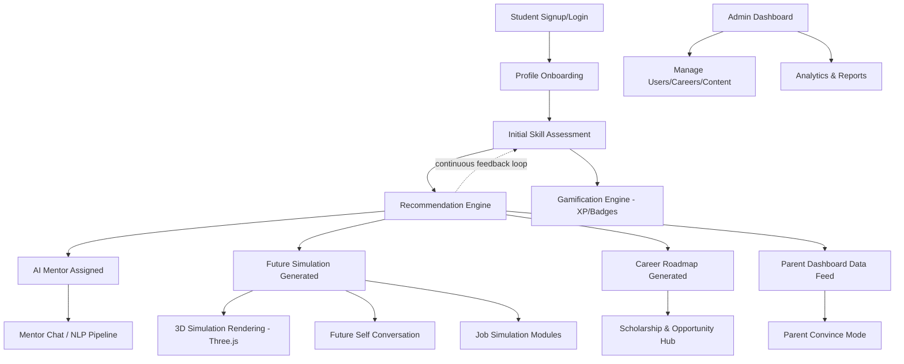

## 11. Use Case Diagram (Text Description)

**Actors:** Student, Parent, Admin, AI Mentor Service, Recommendation Engine

**Student use cases:** Register/Login, Build Profile, Chat with AI Mentor, Run Future Simulation, Talk to Future Self, Attempt Job Simulation, View Roadmap, Browse Opportunities, Earn XP/Badges, View Dashboard, Submit Feedback

**Parent use cases:** Register/Login, Link to Student Account, View Skill Analysis, View Future Demand & Salary Projections, View Career Roadmap Summary, Provide Feedback

**Admin use cases:** Login (elevated auth), Manage Users, Manage Careers Catalog, Manage Scholarships/Jobs, Manage Mentors/Avatars, View Analytics & Reports, Moderate Content, Publish Announcements

**System use cases (invoked by actors indirectly):** Generate Recommendations, Generate Future Simulation Content, Run Skill Assessment, Send Notifications

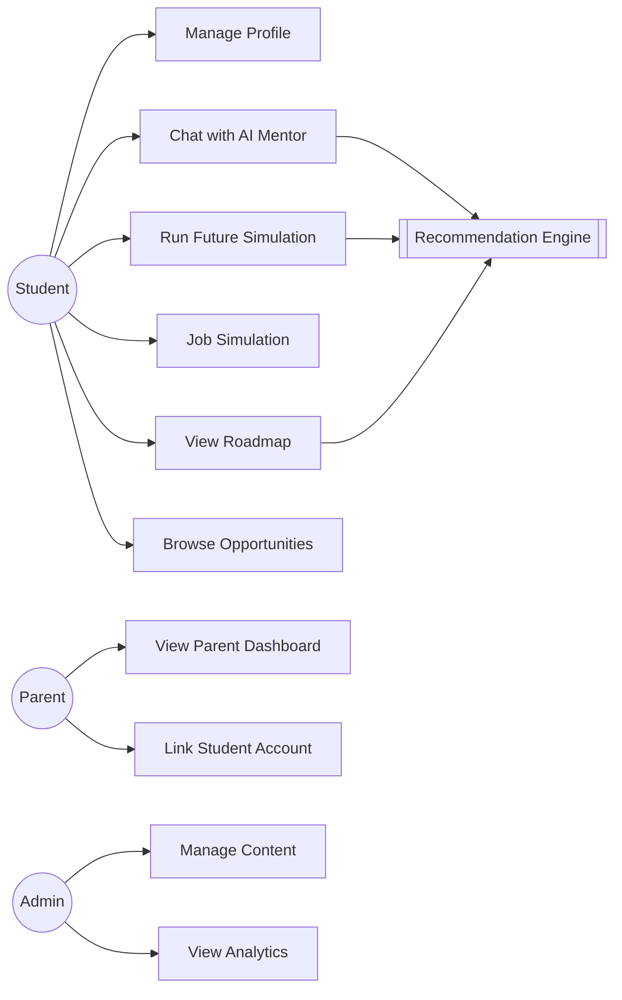

## 12. User Stories

| ID | As a... | I want to... | So that... |
|---|---|---|---|
| US-1 | Student | create a profile with my interests and marks | I get relevant career recommendations |
| US-2 | Student | chat with my AI Mentor | I can get career and academic guidance anytime |
| US-3 | Student | experience a career in 3D simulation | I understand what the job actually feels like |
| US-4 | Student | talk to my "future self" | I stay motivated about a career path |
| US-5 | Student | see a semester-wise roadmap | I know exactly what to do next |
| US-6 | Student | earn XP and badges | I stay engaged and motivated to keep using the app |
| US-7 | Parent | see why a career suits my child | I can support their decision with confidence |
| US-8 | Parent | see expected salary and growth data | I can evaluate the practicality of the career |
| US-9 | Admin | manage the careers catalog | the platform content stays accurate and current |
| US-10 | Admin | view usage analytics | I can make data-driven product decisions |

## 13. User Journey

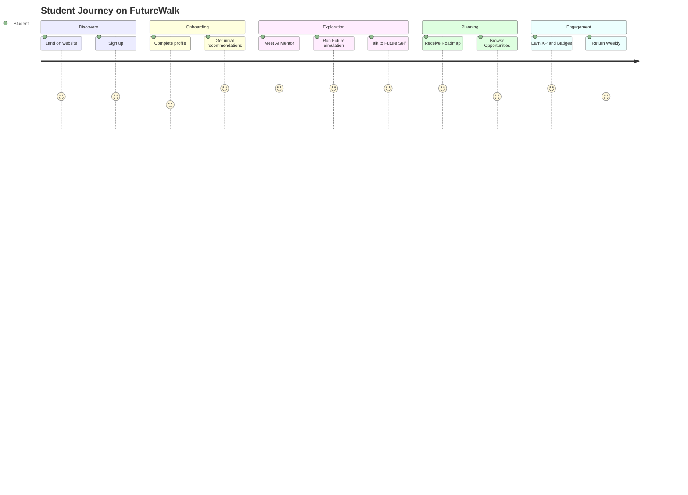

## 14. Admin Journey

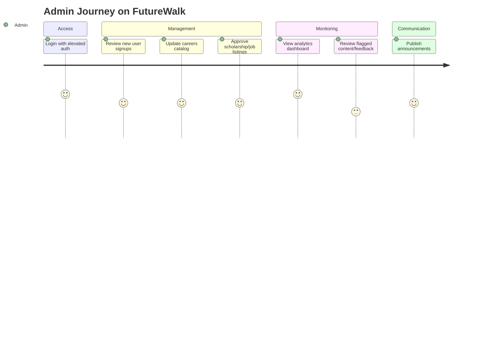
## 15. Database Design

FutureWalk uses **Firestore** (NoSQL, document-collection model) for the MVP, chosen for real-time sync, tight Firebase Auth integration, and horizontal scalability. Below is the logical data model.

| Entity | Description |
|---|---|
| User | Base account record (student, parent, or admin) with role flag |
| StudentProfile | Interests, skills, marks, hobbies, personality, career goals |
| Mentor | Avatar config, personality traits, linked student ID |
| ChatSession / ChatMessage | Conversation history with AI Mentor / Future Self |
| Career | Career catalog entry (title, description, demand data, salary bands) |
| Simulation | Generated simulation instance linked to student + career |
| JobSimulation | Company-style simulation module and results |
| Roadmap | Semester-wise plan linked to student |
| Opportunity | Scholarship/hackathon/internship/competition listing |
| SkillAssessment | Scored technical/soft-skill snapshot over time |
| GamificationProfile | XP, level, streak, badges, achievements |
| ParentLink | Mapping between parent account and student account(s) |
| Feedback | Feedback submissions from students/parents |
| AdminLog | Audit trail of admin actions |

## 16. Firestore Collections

```
/users/{userId}
/studentProfiles/{studentId}
/mentors/{mentorId}
/chatSessions/{sessionId}/messages/{messageId}
/careers/{careerId}
/simulations/{simulationId}
/jobSimulations/{jobSimId}
/roadmaps/{roadmapId}
/opportunities/{opportunityId}
/skillAssessments/{assessmentId}
/gamificationProfiles/{studentId}
/parentLinks/{linkId}
/feedback/{feedbackId}
/adminLogs/{logId}
/announcements/{announcementId}
```

**Sample document shape — `studentProfiles/{studentId}`:**

```json
{
  "userId": "string",
  "grade": "string",
  "interests": ["string"],
  "skills": ["string"],
  "marks": { "subject": "number" },
  "hobbies": ["string"],
  "personalityTraits": ["string"],
  "careerGoals": ["string"],
  "createdAt": "timestamp",
  "updatedAt": "timestamp"
}
```

## 17. ER Diagram (Text)

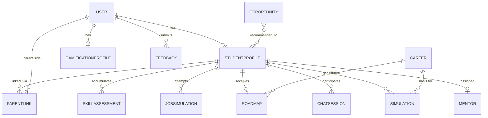

## 18. API List

| Method | Endpoint | Description |
|---|---|---|
| POST | /api/auth/register | Register new user |
| POST | /api/auth/login | Login user |
| GET | /api/users/:id | Get user profile |
| PUT | /api/students/:id/profile | Update student profile |
| POST | /api/mentor/chat | Send message to AI Mentor, get response |
| GET | /api/mentor/:studentId | Get mentor config |
| PUT | /api/mentor/:studentId | Update mentor avatar/personality |
| POST | /api/simulation/generate | Generate a Future Simulation for a career |
| GET | /api/simulation/:id | Retrieve simulation details |
| POST | /api/future-self/chat | Chat with AI Future Self |
| GET | /api/jobsimulation/:careerId | Get job simulation module |
| POST | /api/jobsimulation/:id/submit | Submit job simulation task result |
| GET | /api/roadmap/:studentId | Get personalized roadmap |
| POST | /api/roadmap/generate | Regenerate roadmap after profile update |
| GET | /api/opportunities | List recommended opportunities |
| GET | /api/skills/:studentId | Get skill assessment history |
| POST | /api/skills/assess | Submit new skill assessment inputs |
| GET | /api/gamification/:studentId | Get XP, level, streak, badges |
| POST | /api/gamification/event | Log an XP-earning event |
| GET | /api/parent/dashboard/:studentId | Get parent dashboard data |
| POST | /api/parent/link | Link parent account to student |
| GET | /api/admin/users | List/manage users |
| GET | /api/admin/analytics | Retrieve platform analytics |
| POST | /api/admin/careers | Create/update career catalog entry |
| POST | /api/feedback | Submit feedback |

## 19. Module-wise Architecture

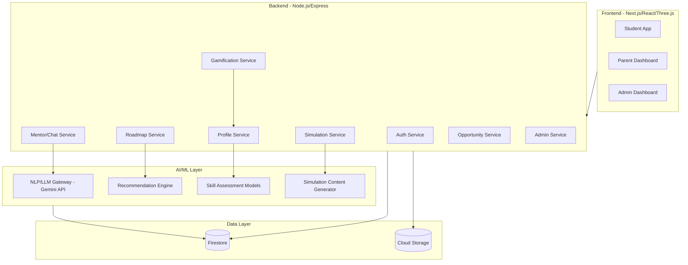
## 20. AI Architecture

FutureWalk's AI layer is composed of four cooperating subsystems:

1. **Conversational Layer (LLM-driven):** Powers AI Mentor and Future Self conversations using an LLM (e.g., Gemini API) with prompt templates conditioned on student profile, chat history, and mentor personality settings. Retrieval-Augmented Generation (RAG) is used to ground responses in a curated knowledge base of careers, courses, scholarships, and skill data.
2. **Recommendation Layer:** Hybrid recommendation system (content-based + collaborative filtering) combining structured profile features (marks, interests) with behavioral signals (chat topics, simulation choices) to rank career and opportunity recommendations. Uses Random Forest / XGBoost for structured feature scoring blended with embedding similarity for content-based matching.
3. **Assessment Layer:** ML classifiers score technical/soft-skill dimensions from quiz responses, chat sentiment, and simulation performance (e.g., job simulation task outcomes).
4. **Generative Simulation Layer:** LLM-driven content generation produces scripted simulation scenes, dialogue, and "day-in-the-life" narratives, which are rendered into the Three.js 3D environment as structured scene descriptors (not raw code) that the frontend interprets.

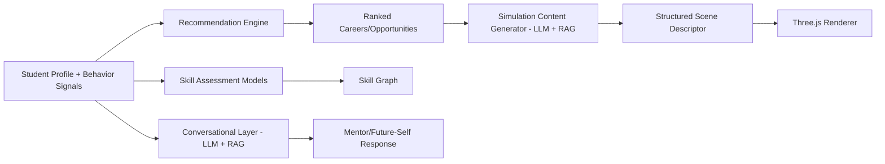

## 21. NLP Pipeline

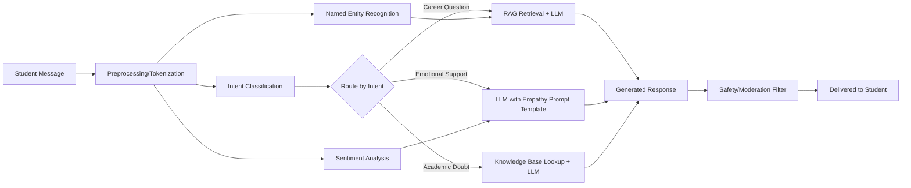

Key NLP components: Intent Classification (BERT-based), Named Entity Recognition (careers, skills, subjects), Sentiment Analysis (for emotional-support routing), and a moderation/safety filter enforced before any response reaches a student, given the minor-heavy user base.

## 22. ML Pipeline

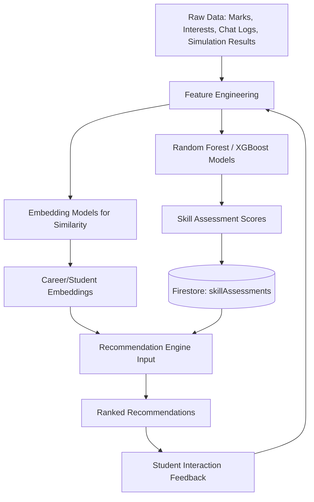

The pipeline is designed as a continuous feedback loop: every interaction (simulation choice, chat topic, roadmap step completion) becomes a new training signal for future recommendation refinement.

## 23. Recommendation Engine Workflow

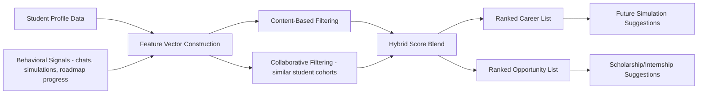

## 24. Future Simulation Workflow

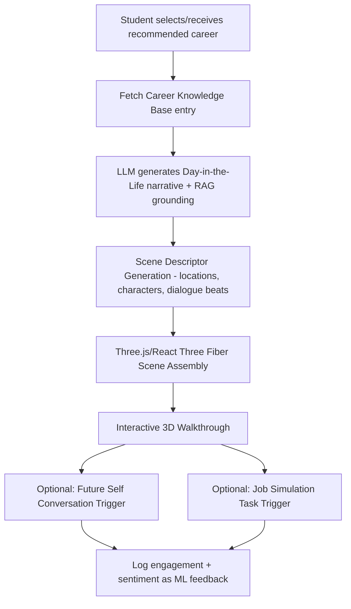

## 25. Parent Mode Workflow

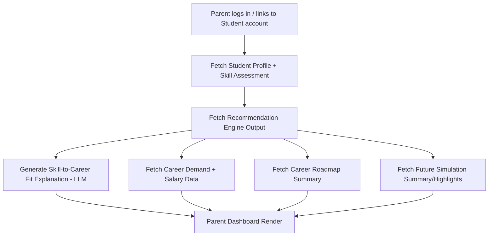

## 26. Admin Workflow

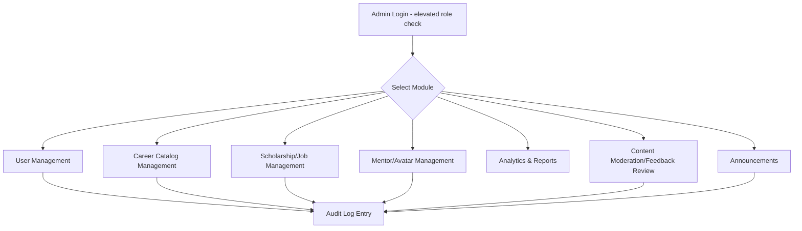
## 27. Folder Structure

```
futurewalk/
├── apps/
│   ├── web/                        # Next.js frontend (student + parent + admin)
│   │   ├── app/
│   │   │   ├── (student)/
│   │   │   │   ├── dashboard/
│   │   │   │   ├── mentor/
│   │   │   │   ├── simulation/
│   │   │   │   ├── job-simulation/
│   │   │   │   ├── roadmap/
│   │   │   │   ├── opportunities/
│   │   │   │   └── profile/
│   │   │   ├── (parent)/
│   │   │   │   └── parent-dashboard/
│   │   │   ├── (admin)/
│   │   │   │   └── admin/
│   │   │   └── (auth)/
│   │   │       ├── login/
│   │   │       └── register/
│   │   ├── components/
│   │   │   ├── mentor/
│   │   │   ├── simulation-3d/
│   │   │   ├── gamification/
│   │   │   └── shared/
│   │   ├── lib/
│   │   └── styles/
│   └── admin/                       # (optional) standalone admin app
├── services/
│   ├── api-gateway/                 # Node.js/Express REST layer
│   ├── mentor-service/
│   ├── simulation-service/
│   ├── recommendation-service/
│   ├── skill-assessment-service/
│   └── gamification-service/
├── ai/
│   ├── nlp-pipeline/
│   ├── ml-models/
│   └── prompts/
├── shared/
│   ├── types/
│   └── config/
├── firebase/
│   ├── firestore.rules
│   └── storage.rules
└── docs/
    └── SRS.md
```

## 28. UI Pages

| Page | Users | Purpose |
|---|---|---|
| Landing Page | All | Marketing intro, sign-up CTA |
| Register / Login | All | Auth entry point |
| Onboarding Profile Wizard | Student | Collect interests, skills, marks, hobbies, goals |
| Student Dashboard | Student | Progress, XP, chats, roadmap, opportunities summary |
| AI Mentor Chat | Student | Conversational guidance |
| Mentor Customization | Student | Avatar & personality selection |
| Future Simulation Hub | Student | Career selection + 3D simulation launcher |
| 3D Simulation View | Student | Immersive career walkthrough |
| Future Self Chat | Student | Conversation with future-self AI |
| Job Simulation | Student | Interview/meeting/coding/presentation tasks |
| Roadmap View | Student | Semester-wise plan |
| Opportunity Hub | Student | Scholarships, hackathons, internships, courses |
| Skill Graph | Student | Visualized skill assessment results |
| Parent Dashboard | Parent | Skill fit, demand, salary, roadmap summary |
| Admin — Users | Admin | User management |
| Admin — Careers | Admin | Career catalog CRUD |
| Admin — Opportunities | Admin | Scholarship/job CRUD |
| Admin — Mentors | Admin | Mentor/avatar catalog management |
| Admin — Analytics | Admin | Platform usage metrics |
| Admin — Feedback | Admin | Feedback review |
| Admin — Announcements | Admin | Publish platform-wide announcements |

## 29. Navigation Flow

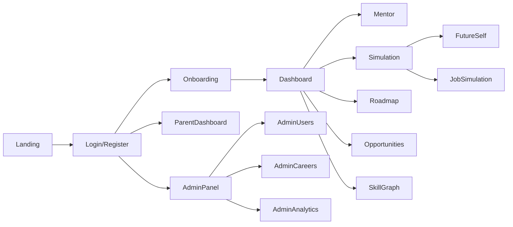

## 30. Role-Based Authentication Flow

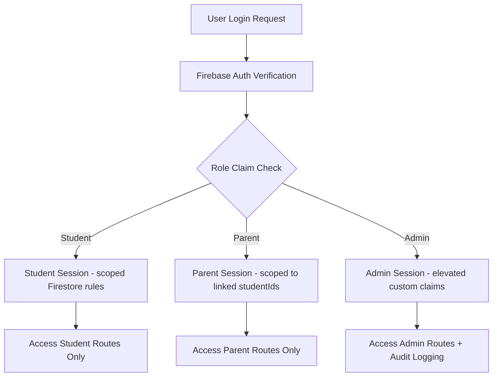

Role assignment uses Firebase custom claims (`student`, `parent`, `admin`). Firestore security rules enforce document-level access so that, e.g., a parent can only read student documents explicitly linked via `parentLinks`.

## 31. Security Requirements

| ID | Requirement |
|---|---|
| SEC-1 | All API traffic served over HTTPS/TLS |
| SEC-2 | Firestore security rules enforce role- and ownership-based document access |
| SEC-3 | AI Mentor and Future Self conversations pass through a content moderation layer before delivery, given the minor-heavy user base |
| SEC-4 | No collection of unnecessary PII from minors beyond what is required for the service (data minimization) |
| SEC-5 | Parental consent flow required before a minor's detailed profile data is shared with any third-party integration |
| SEC-6 | Admin actions logged in an immutable audit trail |
| SEC-7 | Rate limiting and abuse detection on Mentor/LLM endpoints to prevent prompt injection and misuse |
| SEC-8 | Secrets (API keys, service credentials) managed via a secrets manager, never committed to source |
| SEC-9 | Regular dependency and vulnerability scanning in CI/CD |

## 32. Scalability Requirements

| ID | Requirement |
|---|---|
| SCA-1 | Stateless API services deployable behind a load balancer for horizontal scaling |
| SCA-2 | AI/LLM calls isolated behind a gateway service supporting request queuing and rate control |
| SCA-3 | Firestore data model designed with denormalization where needed to avoid hot-document contention at scale |
| SCA-4 | Static assets and 3D scene data served via CDN |
| SCA-5 | Recommendation and skill-assessment ML inference services independently scalable from the core API |
| SCA-6 | Multi-region hosting readiness for international expansion |

## 33. Deployment Architecture

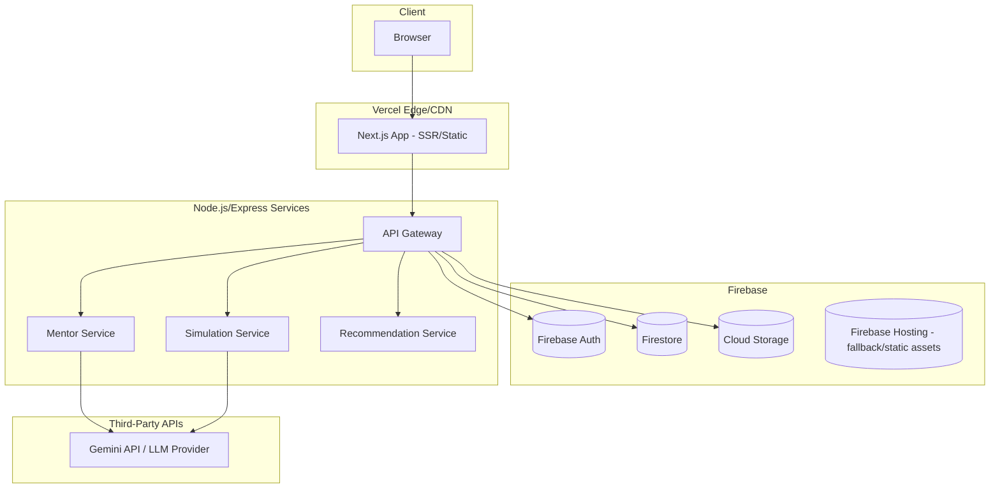

## 34. Third-Party APIs

| API/Service | Purpose |
|---|---|
| Firebase Auth | Authentication (email, Google, phone OTP) |
| Firestore | Primary NoSQL database |
| Firebase Cloud Storage | Avatar images, simulation assets |
| Gemini API (or comparable LLM provider) | Conversational AI, content generation, RAG |
| Vercel | Frontend hosting/CDN/edge functions |
| Email/SMS Provider (e.g., SendGrid/Twilio) | Notifications, OTP delivery |
| Analytics Provider (e.g., Firebase Analytics/Mixpanel) | Usage analytics |
## 35. Risks & Assumptions

### Risks

| Risk | Impact | Mitigation |
|---|---|---|
| LLM hallucination in career/salary data | Medium-High | Ground responses via RAG on curated, admin-verified knowledge base; disclaim projections as estimates |
| Minor safety in open-ended AI chat | High | Mandatory moderation layer, restricted conversation scope, escalation path to human support |
| Firestore cost/performance at scale | Medium | Denormalize hot paths, cache recommendation outputs, monitor read/write patterns |
| Data privacy compliance across regions | Medium-High | Data minimization, consent flows, region-aware compliance review before international launch |
| 3D simulation performance on low-end devices | Medium | Provide a lighter 2D/narrative fallback mode |
| Dependence on a single LLM provider | Medium | Abstract LLM calls behind a provider-agnostic gateway |

### Assumptions

- Students have access to a modern smartphone/laptop with a WebGL-capable browser
- Initial launch targets Indian school/college students, with English (and optionally regional language) support
- Career and salary datasets will be sourced and periodically validated by the FutureWalk content/admin team
- Parents are willing to create linked accounts to access the Parent Dashboard

## 36. Future Enhancements

- Native iOS/Android apps
- VR headset support for Future Simulation
- Corporate/recruiter marketplace for direct hiring pipelines
- Government skill-development program integrations
- Multi-language AI Mentor support
- Peer-to-peer mentorship (senior students mentoring juniors)
- Institution-level analytics dashboards for schools/colleges

## 37. MVP Scope

The MVP focuses on proving the core USP loop: **Profile → Recommendation → Simulation → Roadmap → Engagement.**

Included in MVP:
- Student registration/profile/onboarding
- AI Mentor (text chat, basic avatar customization)
- Future Simulation for the 10 launch careers (narrative + basic 3D scene, not full interactivity)
- Basic Job Simulation (one task type, e.g., interview simulation)
- Career Roadmap generation
- Scholarship & Opportunity Hub (curated static + basic matching)
- Core Gamification (XP, streaks, badges)
- Student Dashboard
- Parent Dashboard (skill fit, roadmap summary)
- Admin Dashboard (users, careers, opportunities, basic analytics)

Excluded from MVP (see Version 2/3):
- Full multi-scene interactive 3D job simulations
- Advanced hybrid recommendation with collaborative filtering across large cohorts
- Corporate/recruiter features
- Native mobile apps

## 38. Version 2 Features

- Expanded career catalog (30+ careers)
- Full interactive Job Simulation suite (coding tasks, live-style client interactions, teamwork scenarios)
- Collaborative-filtering-based recommendations using cross-student cohort data
- Leaderboards and social/competitive gamification features
- Multi-language support
- Mobile app (React Native or native)
- Advanced parent analytics (peer comparison, trend tracking)

## 39. Version 3 Vision

- VR/AR-enabled Future Simulation
- Institutional dashboards for schools, colleges, and universities at scale
- Corporate and recruiter marketplace with verified hiring pipelines
- Government/skill-development body integrations for scholarship and certification pipelines
- Global multi-country career datasets and localization
- AI-driven longitudinal outcome tracking (does the recommended career path correlate with real-world success?)

## 40. Development Roadmap

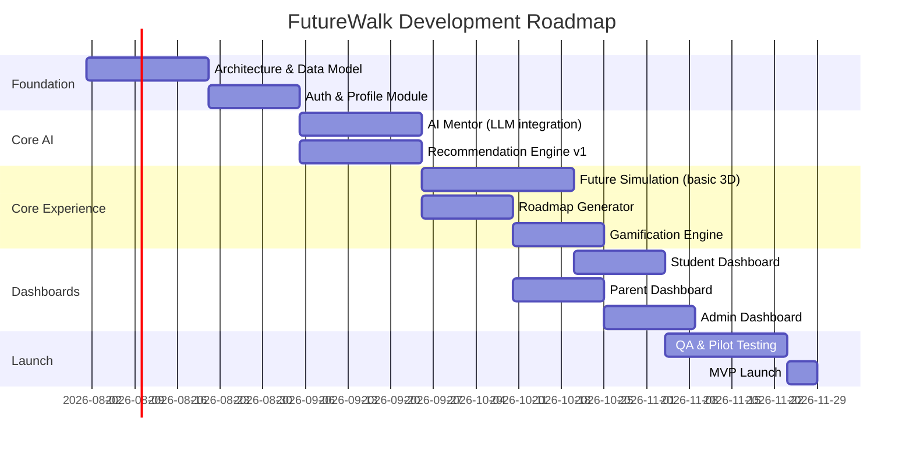

## 41. Sprint Planning

Assuming 2-week sprints with a small cross-functional team (PM, 2 frontend, 2 backend, 1 AI/ML engineer, 1 designer, 1 QA):

| Sprint | Focus |
|---|---|
| 1-2 | Project setup, data model, Firebase Auth, base UI shell |
| 3-4 | Student profile/onboarding, Admin — careers catalog CRUD |
| 5-6 | AI Mentor v1 (LLM gateway, chat UI, moderation layer) |
| 7-8 | Recommendation Engine v1, Skill Assessment v1 |
| 9-10 | Future Simulation (narrative + basic Three.js scene) |
| 11-12 | Roadmap Generator, Opportunity Hub |
| 13-14 | Gamification Engine, Student Dashboard |
| 15-16 | Parent Dashboard, Admin Analytics |
| 17-18 | Job Simulation (basic interview module) |
| 19-20 | QA hardening, pilot testing, bug fixes, launch prep |

## 42. Testing Strategy

| Test Type | Coverage |
|---|---|
| Unit Testing | Individual service functions (recommendation scoring, XP calculation, API handlers) |
| Integration Testing | API Gateway ↔ Firestore ↔ AI services end-to-end flows |
| AI/LLM Output Testing | Prompt regression tests, moderation-filter effectiveness, hallucination spot-checks against curated knowledge base |
| UI/UX Testing | Cross-browser and responsive testing for student/parent/admin flows |
| Performance Testing | Load testing API Gateway and LLM gateway under concurrent chat sessions |
| Security Testing | Firestore rules testing, penetration testing on auth flows, dependency vulnerability scans |
| Accessibility Testing | WCAG 2.1 AA audit on core student flows |
| User Acceptance Testing (UAT) | Pilot cohort of real students/parents validating core USP loop |

## 43. Pilot Testing Plan

1. Recruit a pilot cohort (e.g., 2-3 partner schools/colleges, 100-300 students, plus a parent subset)
2. Run a 4-6 week pilot covering onboarding through roadmap generation and at least one Future Simulation
3. Collect quantitative metrics (activation rate, simulation completion rate, chat engagement) and qualitative feedback (surveys, interviews)
4. Run a moderated feedback session with parents on the Parent Dashboard's clarity and persuasiveness
5. Triage findings into MVP-blocking fixes vs. Version 2 backlog items
6. Iterate and re-test the highest-risk flows (AI Mentor safety/moderation, Future Simulation performance) before public launch

## 44. KPIs & Success Metrics

| Metric | Definition | Target (Post-Pilot) |
|---|---|---|
| Activation Rate | % of signups completing onboarding profile | ≥ 70% |
| Simulation Completion Rate | % of students completing at least one Future Simulation | ≥ 50% |
| Mentor Engagement | Avg. mentor chat sessions per active student per week | ≥ 3 |
| Roadmap Adoption | % of students viewing their generated roadmap | ≥ 60% |
| Retention (Week 4) | % of students still active 4 weeks post-signup | ≥ 35% |
| Parent Dashboard Usage | % of linked parents viewing dashboard at least once | ≥ 40% |
| NPS (Student) | Net Promoter Score from pilot survey | ≥ 40 |
| Content Safety Incidents | Flagged/moderated AI responses per 1,000 chats | As low as possible; target < 1 |

## 45. Startup Scaling Strategy

1. **Phase 1 — Pilot & MVP:** Validate core USP loop with a small number of partner schools/colleges; refine AI accuracy and safety.
2. **Phase 2 — Regional Scale:** Expand career catalog, add Version 2 features, onboard more schools/colleges within one country, introduce basic monetization (e.g., institutional subscriptions or freemium premium simulations).
3. **Phase 3 — National Scale:** Build institutional dashboards, deepen scholarship/opportunity partnerships, invest in mobile apps and multi-language support.
4. **Phase 4 — International Expansion:** Localize career/salary datasets per country, pursue government/skill-development partnerships, expand data residency/compliance posture.
5. **Phase 5 — Ecosystem Play:** Introduce corporate/recruiter marketplace, verified hiring pipelines, and longitudinal outcome tracking to build a defensible data moat.

Throughout all phases, the AI/data flywheel (more usage → better recommendations → better outcomes → more trust/usage) is the core defensibility strategy, supported by rigorous safety and privacy practices given the minor-heavy user base.

## 46. Appendix

### A. Glossary

| Term | Definition |
|---|---|
| USP | Unique Selling Proposition |
| RAG | Retrieval-Augmented Generation |
| LLM | Large Language Model |
| NLP | Natural Language Processing |
| MVP | Minimum Viable Product |
| XP | Experience Points (gamification currency) |
| WCAG | Web Content Accessibility Guidelines |

### B. Assumptions Recap

- All AI-generated avatars are original, non-copyrighted cartoon-style characters.
- Career/salary/demand data will be sourced from publicly available labor-market data and periodically reviewed by the admin/content team for accuracy.
- This SRS is requirements-only; no source code is included per project instructions, and it is intended to be detailed enough for an AI coding assistant (e.g., Cursor AI) or a human engineering team to begin implementation directly.

### C. Document Change Log

| Version | Date | Change |
|---|---|---|
| 1.0 | 2026-07-18 | Initial SRS draft covering all 46 requested sections |

---

*End of Document.*
